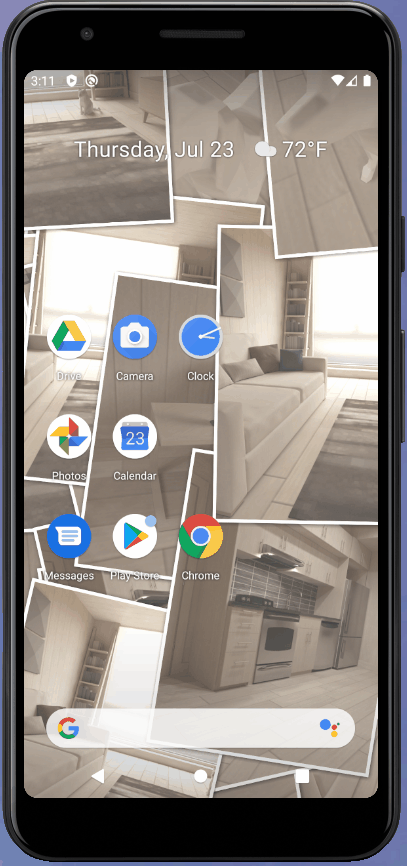

# Pile Up Pict Wallpaper

スマホ内の画像が折り重なるように次々に表示されるAndroid用のライブ壁紙です。

## Description

- Android用のライブ壁紙です
- 画像を折り重なるように表示します
- 表示する画像は指定できます
- スライドショーの設定は好みに合わせて調整できます

## Requirement

- Android 8.0以上

## Usage

1. アプリアイコン、または 設定-外観-壁紙 で ライブ壁紙 設定画面を表示する
2. *Pile Up Pict Wallpaper* を選択する
3. 設定ボタンを押す
4. Playlist を選択する
5. (+) アイコンを押し、表示する画像をプレイリストに追加する
6. 戻るボタンでプレビュー画面に戻る
7. 設定ボタンで *Pile Up Pict Wallpaper* を壁紙に設定する

## Install

- [Google Play Store で公開](https://play.google.com/store/apps/details?id=tech.takumisoft.pileuppictwallpaper)

## Privacy Policy

- [Privacy Policy について](PrivacyPolicy.md)
